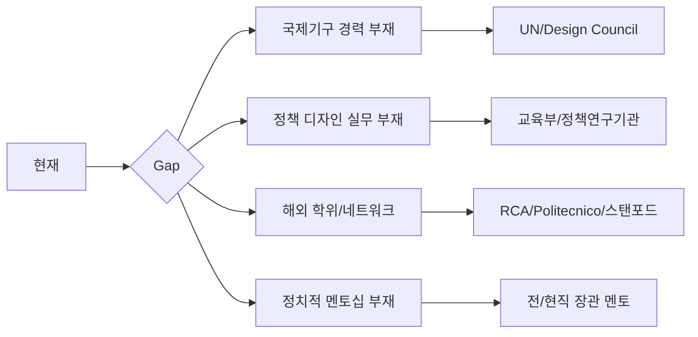

# 🎯 Life Design Strategic Framework for 김진원

> **Ultimate Vision**: AI 공진화 시대, 대한민국 교육부 장관으로서 "자기다운 삶을 성장시키는 국가 시스템"을 설계하는 리더

---

## 📊 현재 상황 분석 (As-Is)

### 강점 (Strengths)
| 영역 | 역량 |
|------|------|
| **디자인 전문성** | BX/UX 통합 디자이너, 디자인씽킹 전문가, 이노베이션 퍼실리테이터 |
| **교육/연구** | 한양대 겸임교수, 홍익대 시각디자인과 박사과정 수료 |
| **실무 경험** | GS SHOP 혁신조직 리더, PaTI 디자인씽킹 연구소장, MYSC 수석 컨설턴트 |
| **컨설팅/퍼실리테이션** | 대기업, 정부조직, 스타트업 다수 프로젝트 |
| **글로벌 경험** | 구글 AVPN AI 트레이너, MTA Asia Director |

### 갭 분석 (Gap Analysis)



---

## 🧭 Meta-System: Life Design Operating System (LDOS)

### 1. 핵심 원칙 (Core Principles)

| 원칙 | 설명 |
|------|------|
| **Prototype Mindset** | 큰 결정도 작은 실험으로 검증 (스탠포드 Life Design 철학) |
| **Strategic Narrative** | 모든 경험을 하나의 일관된 스토리로 연결 |
| **Leverage Points** | 최소 투입, 최대 영향력 지점 식별 |
| **Network Capital** | 관계가 기회로 변환되는 시스템 구축 |
| **Evidence-Based** | 감이 아닌 데이터로 의사결정 |

---

### 2. 전략 피라미드 (5-Layer Strategy Pyramid)

```
                    ┌─────────────────┐
                    │   🎯 VISION     │  교육부 장관
                    │   (20-25년)     │  AI 시대 교육 시스템 설계자
                    └────────┬────────┘
                             │
                    ┌────────▼────────┐
                    │  🏔️ MILESTONE   │  UN SDG 교육 프로젝트 리드
                    │   (10-15년)     │  정책연구기관 디렉터
                    └────────┬────────┘
                             │
                    ┌────────▼────────┐
                    │  🎓 PLATFORM    │  해외 석사/박사
                    │   (3-5년)       │  국제기구 entry
                    └────────┬────────┘
                             │
                    ┌────────▼────────┐
                    │  🔧 CAPABILITY  │  정책디자인 역량
                    │   (1-3년)       │  연구/출판 실적
                    └────────┬────────┘
                             │
                    ┌────────▼────────────┐
                    │  📍 IMMEDIATE ACTION │  지금 당장
                    │      (0-1년)         │  전략적 움직임
                    └─────────────────────┘
```

---

## 🛤️ 3개 병렬 트랙 전략 (Triple Track Strategy)

### Track A: 학술/연구 트랙 (Academic Track)
**목표**: 권위 있는 연구자로 포지셔닝

| 단계 | 기간 | 액션 |
|------|------|------|
| **A1** | 6개월 | 박사논문 완성, SCI/SSCI 논문 1편 투고 |
| **A2** | 1-2년 | 해외 대학원 지원 (RCA, Politecnico Milano, Stanford d.school) |
| **A3** | 3-5년 | 해외 박사/포닥, 국제 저널 3편+, 학회 발표 |
| **A4** | 5-10년 | 한국 귀환, 교수직 or 연구소 디렉터 |

### Track B: 정책/공공 트랙 (Policy Track)
**목표**: 정책 디자인 실무 경험 축적

| 단계 | 기간 | 액션 |
|------|------|------|
| **B1** | 즉시 | UK Design Council Policy Lab 연구 및 적용 케이스 스터디 |
| **B2** | 6-12개월 | 해외 정책디자인 펠로십/인턴십 지원 |
| **B3** | 1-3년 | OECD/UN SDG/World Bank 프로젝트 참여 |
| **B4** | 3-5년 | 한국 정부 파견 or 국내 정책 프로젝트 리드 |

### Track C: 네트워크/영향력 트랙 (Influence Track)
**목표**: 전략적 인맥과 가시성 확보

| 단계 | 기간 | 액션 |
|------|------|------|
| **C1** | 즉시 | LinkedIn 영문 프로필 최적화, 글로벌 전문가 연결 |
| **C2** | 3-6개월 | 국제 컨퍼런스 발표 (RSD, DMI, SDN 등) |
| **C3** | 6-12개월 | 영문 책/아티클 출판 (디자인+정책+AI 교육) |
| **C4** | 1-3년 | 전/현직 장관급 멘토 확보 |

---

## 📈 OKR Framework (Objectives & Key Results)

### 2025년 (즉시 - 1년)

#### Objective 1: 국제 학술 진출 기반 마련
| Key Result | 측정 지표 | 목표값 |
|------------|----------|--------|
| KR1.1 | 해외 대학원 지원서 완성 | 3개교 |
| KR1.2 | SCI/SSCI 논문 투고 | 1편 |
| KR1.3 | 국제 컨퍼런스 발표 | 2회 |
| KR1.4 | 영문 포트폴리오/CV 완성 | 100% |

#### Objective 2: 정책 디자인 역량 가시화
| Key Result | 측정 지표 | 목표값 |
|------------|----------|--------|
| KR2.1 | UK Policy Lab 방법론 케이스 스터디 출판 | 1편 |
| KR2.2 | 정책 디자인 관련 글로벌 네트워크 연결 | 5명 |
| KR2.3 | 한국 정책 기관 접촉 (교육부, KDI 등) | 3곳 |

#### Objective 3: 전략적 네트워크 구축
| Key Result | 측정 지표 | 목표값 |
|------------|----------|--------|
| KR3.1 | 해외 정책디자인 전문가 1:1 대화 | 3명 |
| KR3.2 | 한국 정치/정책 커리어 멘토 확보 | 1명 |
| KR3.3 | LinkedIn 팔로워 / 글로벌 가시성 | 10X 증가 |

---

## 🧠 상담해야 할 전문가 카테고리

### 1. Life Design / Career Strategy 전문가

| 전문가 | 소속/배경 | 상담 포인트 |
|--------|----------|-------------|
| **Bill Burnett & Dave Evans** | Stanford d.school Life Design Lab | Life Design 방법론 원저자, 접근법 직접 배움 |
| **Herminia Ibarra** | London Business School | Working Identity 저자, 경력 전환 전문가 |
| **Reid Hoffman** | LinkedIn 창업자 | 네트워크 전략, "The Startup of You" 저자 |
| **김창준** | 애자일 컨설팅 | 한국의 커리어/역량 개발 전문 코치 |

### 2. 국제기구/정책 디자인 진출 전문가

| 전문가 | 소속/배경 | 상담 포인트 |
|--------|----------|-------------|
| **Andrea Siodmok** | UK Design Council (전 Head of Policy Lab) | 정부 정책 디자인의 개척자 |
| **Christian Bason** | Danish Design Centre CEO | 공공 서비스 디자인 세계적 권위자 |
| **Sabine Junginger** | Lucerne Univ. Applied Sciences | 디자인과 공공정책 연결 학자 |
| **Jesper Christiansen** | MindLab (전), Demos Helsinki | 북유럽 정책 혁신 전문가 |
| **Marc Patton** | UNDP Innovation Facility | UN 혁신/디자인 프로젝트 리더 |

### 3. 한국 정치/정책 커리어 전문가

| 전문가 | 소속/배경 | 상담 포인트 |
|--------|----------|-------------|
| **유시민** | 전 보건복지부 장관 | 학자 → 정치인 → 장관 경로 |
| **이주호** | 전 교육부 장관, KDI | 교육 정책 + 장관 경험 |
| **정재승** | KAIST 교수 | 학자 + 정책 자문 + 대중적 영향력 |
| **김영세** | 이노디자인 | 디자이너로서 정책/사회적 영향력 확보 경험 |

### 4. 해외 유학/학술 커리어 전문가

| 전문가 | 소속/배경 | 상담 포인트 |
|--------|----------|-------------|
| **해당 대학 Alumni 네트워크** | RCA, Politecnico, Stanford | 지원 전략, 학교 생활, 이후 진로 |
| **Fulbright/Chevening Alumni** | 각 장학재단 | 장학금 지원 전략 |

---

## 🔄 전략 점검 시스템 (Strategy Review System)

### Weekly Review (매주 일요일)
```
□ 이번 주 3개 트랙 중 어디에 시간 투자했나?
□ 핵심 액션 진행률은?
□ 다음 주 우선순위 1가지는?
```

### Monthly Review (매월 마지막 주)
```
□ OKR 진행률 체크 (0-100%)
□ 네트워크 추가된 인맥 정리
□ Prototype 실험 결과 분석
□ 다음 달 핵심 액션 3가지 설정
```

### Quarterly Review (3개월마다)
```
□ 큰 그림 점검: 비전-현실 갭 체크
□ 전략 피벗 필요 여부 결정
□ 외부 멘토/코치와 1:1 리뷰
□ 다음 분기 OKR 재설정
```

---

## ⚡ 즉시 실행 (Immediate Actions) - 다음 30일

| 우선순위 | 액션 | 기대 결과 |
|----------|------|----------|
| 🔴 **1** | LinkedIn 영문 프로필 완전 리뉴얼 | 글로벌 가시성 확보 |
| 🔴 **2** | Andrea Siodmok (UK Policy Lab) LinkedIn 연결 시도 | 정책 디자인 멘토 후보 |
| 🟠 **3** | RCA, Stanford, Politecnico 입학 요건 상세 조사 | 지원 로드맵 수립 |
| 🟠 **4** | 2026년 국제 컨퍼런스 CFP 조사 (RSD, DMI, SDN) | 발표 기회 탐색 |
| 🟢 **5** | 박사논문 → 영문 저널 논문 변환 계획 | 학술 실적 기반 마련 |

---

## 💡 전략적 인사이트

### 왜 한국 기관에서 기회가 안 왔을까?

1. **Narrative 부재**: 진원님의 다양한 경험을 "정책 디자이너"로 연결하는 스토리가 명확하지 않았음
2. **Positioning 문제**: "디자인씽킹 전문가"로 알려져 있지, "정책 디자이너"로는 인식 안 됨
3. **Gate Keeper 접근 부재**: 의사결정자와 직접 연결되는 루트 부족
4. **경쟁 구도**: 국내는 레드오션, 해외 경력으로 차별화 필요

### 권장 전략: "밖에서 안으로" (Outside-In)

> 한국에서 직접 뚫기보다, **해외에서 성과 → 한국으로 초빙**되는 루트가 확률 높음

- 예시: 해외 박사 → UN/OECD 경력 → 한국 정책연구기관 영입 → 정부 요직

---

## 📚 추천 리소스

### 도서
- *Designing Your Life* - Bill Burnett & Dave Evans
- *Working Identity* - Herminia Ibarra  
- *The Startup of You* - Reid Hoffman
- *Design for Policy* - Christian Bason (편저)
- *How to Get a Job at the UN* - Natalie C. Hill

### 온라인 코스
- Stanford Life Design Online
- IDEO U: From Ideas to Action
- Coursera: UN SDG 관련 과정

### 커뮤니티/네트워크
- Service Design Network (SDN)
- Design Management Institute (DMI)
- RSD (Relating Systems Thinking and Design) Symposium
- Policy Design Network (LinkedIn)

---

*Last Updated: 2025-12-20*
*Version: 1.0*
